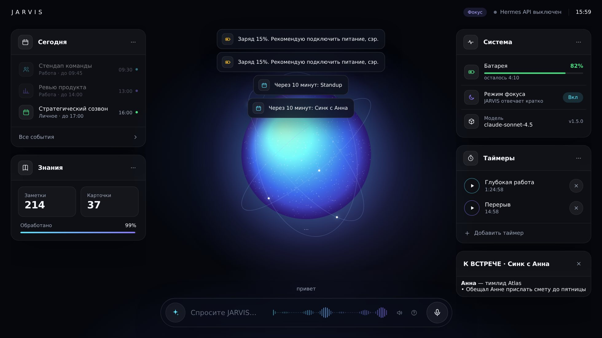

<p align="center"></p>

# J.A.R.V.I.S. on Hermes Agent

<p align="right"><a href="README.en.md">🇬🇧 English</a></p>

> **Just A Rather Very Intelligent System** — персональный голосовой ИИ-ассистент для macOS, Windows и Linux,
> построенный на [Hermes Agent](https://github.com/NousResearch/hermes-agent) (Nous Research, MIT, 240k+ ★).
> Hermes даёт «мозг» (LLM, память, навыки, инструменты, планировщик, мессенджеры),
> этот проект добавляет «тело» и «личность»: управление компьютером, голос, wake word, HUD, брифинги, режимы —
> одинаково полно на всех трёх платформах.

```
  Вы: «Hey Jarvis… что у меня сегодня и включи режим фокуса»
  JARVIS: «Доброе утро, сэр. В половине третьего созвон с командой, вечером спортзал.
           Режим фокуса включён — не побеспокою до конца встречи.»
```

---

## Что умеет

| Область | Возможности | Откуда |
|---|---|---|
| 🎙 **Голос** | wake word «Hey Jarvis» (локально, openWakeWord), push-to-talk `Ctrl+B`, локальный Whisper (STT), Edge/ElevenLabs/OpenAI TTS, барж-ин, стоп-фразы | Hermes voice + наш конфиг |
| 🖥 **Управление компьютером** | приложения, окна, громкость, яркость, тёмная тема, Wi-Fi/Bluetooth, батарея, сон/блокировка, **«что у меня на экране?» → скриншот и анализ без лишних вопросов**, камера, буфер обмена, набор текста и хоткеи, поиск файлов, файловый менеджер, файлы (удаление только в Корзину), обои — на macOS, Windows и Linux | `jarvis-macos` / `jarvis-windows` / `jarvis-linux` (28-29 инструментов на каждой платформе) |
| 📅 **Продуктивность** | Календарь, Напоминания, Заметки, автоматизации (Shortcuts/скрипты), таймеры и будильники, утренний/вечерний брифинг | `jarvis-{macos,windows,linux}` + `jarvis-core` |
| 🎵 **Медиа** | Apple Music/Spotify (macOS), любой плеер через SMTC (Windows) или MPRIS (Linux): play/pause/next, «что играет» | `jarvis-{macos,windows,linux}` |
| 🧠 **Мозг** | любая LLM (OpenRouter, Anthropic, OpenAI, Gemini, Ollama локально…), долговременная память, самообучение навыкам, FTS-поиск по прошлым сессиям | Hermes |
| 📁 **Хранилище файлов** | папка `~/JARVIS`: бросайте туда любые документы, PDF, таблицы, презентации и подключайте целые проекты (или iCloud/Документы/**Obsidian** — на Windows/macOS/Linux — одной командой) — JARVIS индексирует содержимое (FTS5), ищет, читает, **пишет, раскладывает по папкам, переименовывает** (удаление — только в Корзину), правит и запускает код; умеет писать **заметки Obsidian по её конвенциям** (YAML-frontmatter, дневные заметки по вашим настройкам daily-notes); новые файлы замечает сам, записывает их суть в память и предлагает, что сделать. Секреты не индексируются. [docs/VAULT.md](docs/VAULT.md) | плагин `jarvis-brain` (`vault_*`) |
| 🗄 **База знаний** | собственная структурированная база (SQLite+FTS5): люди, проекты, предпочтения, решения, дневник по дням; JARVIS сам пополняет её в диалоге, подмешивает релевантное в каждый ход и **ночью пересматривает структуру** (дубли, конфликты, таксономия, карточки) с бэкапом и журналом изменений. **Помнит, что было верно раньше** (темпоральные факты), ведёт живые резюме карточек, **учится на сбоях собственных инструментов**, уточняет сомнительное утром | плагин `jarvis-brain` |
| 🌐 **Интернет** | веб-поиск, извлечение страниц, браузер (Playwright), картинки, видео с YouTube на HUD | Hermes + `jarvis_hud` |
| 💻 **Разработка** | терминал, файлы, патчи, выполнение кода, делегирование субагентам, Claude Code / Codex как навыки, MCP-серверы | Hermes |
| 🕹 **HUD** | рабочий стол в браузере: сфера-индикатор (реагирует на голос), виджеты на реальных данных — календарь на сегодня, батарея, Focus, модель, таймеры (можно ставить прямо в HUD), база знаний и хранилище; панели от агента (текст/картинки/видео/веб/графики), чат, **озвучка голосом Hermes (edge-tts) прямо в браузере** | `hud/` |
| 📱 **Везде** | Telegram, Discord (в т.ч. голосовые каналы), WhatsApp, Slack, iMessage, Email — одна память и один агент | Hermes gateway |
| ⏰ **Автономность** | **событийные триггеры** (новые файлы в хранилище, возвращение к компьютеру → брифинг, диск, питание — без LLM, пока не появится повод), cron-задачи (брифинг 08:00, вечерний итог, ночная ревизия базы 03:30), локальный watchdog (батарея, **справка из базы перед встречей**, **режим «Не беспокоить» → режим JARVIS**), heartbeat по чек-листу `HEARTBEAT.md`, режимы focus/night/presentation | Hermes cron + `jarvis-core` |
| 🏠 **Умный дом** | Home Assistant (встроенный toolset) или HomeKit через Shortcuts | навык `jarvis-home-automation` |
| 📅 **Календарь** | Google Calendar — единый на macOS/Windows/Linux, не требует Outlook/MSIX; `jarvis calendar setup` один раз | `jarvis_calendar`, `plugins/jarvis-core/gcalendar.py`, `docs/CALENDAR.md` |
| 🔑 **ИИ-провайдер и ключи** | Выбор провайдера/модели и ввод ключей (`hermes model`), отдельная модель для распознавания экрана/фото (`auxiliary.vision`), локальные модели через Ollama одной командой (`jarvis ollama pull/use`, без ключа и интернета) — из трея/меню-бара или терминала | `hermes model`, `jarvis ollama`, `app-windows/jarvis_tray.pyw`, `app-linux/jarvis_tray.py`, `app/JarvisMenuBar.swift`, `docs/AI-MODELS.md` |
| 📦 **Приложение** | JARVIS.app в строке меню (macOS) / значок в трее (Windows, Linux): статус, HUD, голос, «Спросить…», обновления, **мастер первого запуска**, диагностика, автозапуск при входе, **автообновление с GitHub** с бэкапом и откатом | `app/`, `app-windows/`, `app-linux/`, `scripts/update.py` |
| 🔒 **Безопасность** | подтверждение опасных команд (approvals: smart), необратимые действия — только с confirmed=true, локальный STT, секреты не покидают компьютер | Hermes + наши инструменты |


## Как это выглядит

<p align="center"></p>
<p align="center"><sub>Рабочий стол: календарь на сегодня, база знаний, система и таймеры — всё на живых данных Mac.</sub></p>

<p align="center"></p>
<p align="center"><sub>Агент показал график инструментом <code>jarvis_hud</code> — сфера уступает место, диалог остаётся под рукой.</sub></p>

---

## Установка (macOS, 5 минут)

Одна команда в Terminal (скачает последний релиз и запустит установщик с вопросами):

```bash
curl -fsSL https://raw.githubusercontent.com/Ayazbog11/hermes-jarvis-all/main/get.sh | bash
```

Или вручную: [скачать zip релиза](https://github.com/Ayazbog11/hermes-jarvis-all/releases/latest) (внутри — готовое
JARVIS.app, компилятор не нужен) → распаковать → `bash install.sh`. Или `git clone … && cd hermes-jarvis-all && ./install.sh`.

Установщик сам поставит Homebrew-зависимости, Hermes Agent, голосовые пакеты, плагины, личность,
навыки, cron-задачи, команду `jarvis` и (по желанию) автозапуск. В конце спросит провайдера LLM.

После установки выдайте разрешения (один раз): `jarvis perms` откроет нужные панели —
**Микрофон, Универсальный доступ, Запись экрана, Автоматизация** для вашего терминала.

Подробно: [docs/INSTALL.md](docs/INSTALL.md)

После установки JARVIS.app сам проведёт **мастер первого запуска** (модель → права → папка файлов → HUD).
Если что-то не работает — одна команда: **`jarvis doctor --fix`** (проверит модель, плагины, API, HUD, права, хранилище и починит, что может).
Дальше: `jarvis brain import` (JARVIS познакомится с контактами и проектами), `jarvis shortcuts` (команды для Siri и Finder).

## Установка (Windows 10/11, нативно — без WSL)

Тот же функционал (управление системой, HUD, база знаний, хранилище файлов, мессенджеры), кроме
пары вещей без публичного API в Windows — см. таблицу отличий в [docs/INSTALL.windows.md](docs/INSTALL.windows.md).
Прав администратора не требуется.

```powershell
Set-ExecutionPolicy -Scope CurrentUser RemoteSigned    # один раз, разрешить локальные скрипты
iwr -useb https://raw.githubusercontent.com/Ayazbog11/hermes-jarvis-all/main/get.ps1 | iex
```

Или вручную: скачать zip релиза → распаковать → `./install.ps1` в PowerShell (Shift + правый клик в папке →
«Открыть окно PowerShell здесь»). Установщик сам поставит Hermes Agent, голосовые пакеты, плагины (`jarvis-windows`
вместо `jarvis-macos`), личность, навыки, cron-задачи, команду `jarvis`, трей-приложение (значок статуса вместо
строки меню) и автозапуск через Планировщик заданий вместо launchd.

Подробно: [docs/INSTALL.windows.md](docs/INSTALL.windows.md) · раздел Windows в [docs/TROUBLESHOOTING.md](docs/TROUBLESHOOTING.md#приложение-windows-нативный-порт-без-wsl)

## Установка (Linux)

Тот же функционал (управление системой, HUD, база знаний, хранилище файлов, мессенджеры) через стандартные
утилиты рабочего стола (wmctrl/xdotool, pactl, nmcli, bluetoothctl, upower, grim/scrot, notify-send…) —
работает на любом дистрибутиве и рабочем столе (GNOME/KDE/XFCE/…), часть возможностей зависит от того, что
установлено (`jarvis selftest` покажет, чего не хватает именно у вас).

```bash
curl -fsSL https://raw.githubusercontent.com/Ayazbog11/hermes-jarvis-all/main/get.linux.sh | bash
```

Или вручную: `git clone https://github.com/Ayazbog11/hermes-jarvis-all.git && cd hermes-jarvis-all && bash install.linux.sh`.

Установщик сам поставит системные утилиты (best-effort, спросит), Hermes Agent, голосовые пакеты, плагины
(`jarvis-linux` вместо `jarvis-macos`), личность, навыки, cron-задачи, команду `jarvis`, трей-приложение и
(по желанию) автозапуск через `systemd --user`.

Подробно: [docs/INSTALL.linux.md](docs/INSTALL.linux.md) · раздел Linux в [docs/TROUBLESHOOTING.md](docs/TROUBLESHOOTING.md)

## Запуск

```bash
jarvis            # голосовой TUI: «Hey Jarvis» или Ctrl+B
jarvis hud        # голографический HUD → http://127.0.0.1:8765
jarvis up         # gateway (API + мессенджеры) + HUD + TUI — всё сразу
jarvis status     # что запущено
```

Внутри чата: `/voice on`, `/wake on`, `/brief`, `/focus`, `/timer 10 чай`, `/screen`, `/vol 30`, `/lock`,
`/remember …`, `/recall …`, `/brain stats`, `/jarvis` (все навыки).

Полный список команд и примеров фраз: [docs/USAGE.md](docs/USAGE.md)

---

## Структура проекта

```
jarvis-hermes/
├── install.sh / install.ps1 / install.linux.sh   ← установщики: macOS (bash), Windows (PowerShell), Linux (bash)
├── config/HEARTBEAT.md        ← чек-лист тихих проверок (heartbeat)
├── app/                       ← JARVIS.app: Swift-файл строки меню (macOS), Info.plist, build.sh, генератор иконки
├── app-windows/jarvis_tray.pyw← трей-приложение Windows: тот же функционал на Python + pystray
├── app-linux/jarvis_tray.py   ← трей-приложение Linux: то же на Python + pystray (нужно AppIndicator на GNOME)
├── VERSION                    ← текущая версия (меняется → GitHub Release → автообновление)
├── bin/jarvis                 ← CLI-обёртка macOS/Linux: voice / hud / gateway / status / doctor / update
├── bin/jarvis.ps1 + .cmd      ← та же CLI-обёртка для Windows (PowerShell)
├── plugins/
│   ├── jarvis-core/           ← ядро: контекст хода, HUD-события, таймеры, режимы, погода, watchdog, /brief
│   │   ├── plugin.yaml  __init__.py  schemas.py  state.py  hud_client.py  platform_compat.py
│   │   └── skills/{morning-briefing,mac-control,win-control,linux-control}/SKILL.md
│   ├── jarvis-brain/          ← база знаний: SQLite+FTS5, brain_* инструменты, ночная ревизия
│   │   ├── plugin.yaml  __init__.py  schemas.py  db.py
│   │   └── skills/{brain-usage,brain-nightly-review}/SKILL.md
│   ├── jarvis-macos/          ← 29 инструментов управления macOS
│   │   ├── plugin.yaml  __init__.py  schemas.py  tools.py  mac.py
│   ├── jarvis-windows/        ← 29 инструментов управления Windows (PowerShell/WMI/COM вместо AppleScript)
│   │   ├── plugin.yaml  __init__.py  schemas.py  tools.py  win.py
│   └── jarvis-linux/          ← 28 инструментов управления Linux (wmctrl/xdotool/pactl/nmcli/… вместо AppleScript)
│       ├── plugin.yaml  __init__.py  schemas.py  tools.py  linux.py
├── hud/
│   ├── server.py              ← HUD-сервер (stdlib only): SSE, события, прокси к Hermes API
│   ├── sysinfo.py / tts.py    ← кроссплатформенные (macOS + Windows + Linux) источники данных для HUD
│   └── static/index.html      ← интерфейс (арк-реактор, панели, чат, Web Speech)
├── config/
│   ├── SOUL.md                ← личность JARVIS (слот #1 системного промпта Hermes)
│   ├── config.jarvis.yaml / config.jarvis.windows.yaml / config.jarvis.linux.yaml   ← фрагменты конфига под каждую ОС
│   ├── BOOT.md                ← стартовый чек-лист gateway
│   ├── launchd/*.plist        ← автозапуск HUD и gateway на macOS
│   └── systemd/*.service,.timer   ← автозапуск HUD/gateway/updater на Linux (systemd --user)
├── skills/                    ← навыки: briefing, voice-etiquette, research-brief, home-automation
├── hooks/jarvis-boot/         ← gateway-хук: BOOT.md + зеркалирование активности на HUD (кроссплатформенный)
├── scripts/                   ← merge_config.py, setup_cron.sh/.ps1, selftest.py, doctor.py, update.py,
│                                 make_shortcuts.py, setup_scheduled_tasks.py (Windows-автозапуск)
├── get.sh / get.ps1           ← установка одной командой (curl | bash / iwr | iex)
├── skill-bundles/jarvis.{macos,windows,linux}.yaml  ← /jarvis — включить все навыки разом, свой набор на ОС
├── tests/                     ← pytest (135+ тестов, работают и на Linux) + e2e HUD в браузере (Playwright)
└── docs/                      ← INSTALL(.windows/.linux), USAGE, ARCHITECTURE, DEVELOPMENT, TROUBLESHOOTING, RESEARCH
```

## Документация

| Файл | О чём |
|---|---|
| [docs/INSTALL.md](docs/INSTALL.md) | Пошаговая установка, разрешения macOS, выбор LLM, Telegram/Discord, автозапуск, удаление |
| [docs/INSTALL.windows.md](docs/INSTALL.windows.md) | То же для Windows: нативно, без WSL |
| [docs/INSTALL.linux.md](docs/INSTALL.linux.md) | То же для Linux: системные утилиты, systemd --user, трей |
| [docs/USAGE.md](docs/USAGE.md) | Команды `jarvis`, slash-команды, 80+ примеров фраз, режимы, HUD, cron |
| [docs/BRAIN.md](docs/BRAIN.md) | База знаний: модель данных, как JARVIS её пополняет и пересматривает ночью, команды, откат |
| [docs/VAULT.md](docs/VAULT.md) | Хранилище файлов и проектов `~/JARVIS`: что индексируется, как агент этим пользуется, приватность |
| [docs/ARCHITECTURE.md](docs/ARCHITECTURE.md) | Как устроено: Hermes ↔ плагины ↔ HUD, поток данных, схемы |
| [docs/DEVELOPMENT.md](docs/DEVELOPMENT.md) | Как добавить свой инструмент/навык/хук, тесты, соглашения |
| [docs/TROUBLESHOOTING.md](docs/TROUBLESHOOTING.md) | Типовые проблемы: микрофон, Accessibility, wake word, TTS, API |
| [docs/RESEARCH.md](docs/RESEARCH.md) | Исследование: какие проекты и статьи изучены и какие идеи из них взяты (подробно) |
| [docs/SOURCES.md](docs/SOURCES.md) | Список источников: ссылка → что заимствовано |
| [docs/APP.md](docs/APP.md) | JARVIS.app в строке меню и автообновление: каналы, режимы, откат, выпуск версий |
| [docs/SECURITY.md](docs/SECURITY.md) | Модель угроз, разрешения, что не покидает Mac |
| [docs/CHANGELOG.md](docs/CHANGELOG.md) | История версий |

## Требования

- **macOS** 13+ (Apple Silicon или Intel) · **Windows** 10 21H2+/11 (x86_64/ARM64) · **Linux** любой современный
  дистрибутив (Ubuntu/Debian/Fedora/Arch/openSUSE) с X11 или Wayland — ~3 ГБ места (Python, Node, модель Whisper `small`)
- Ключ любого LLM-провайдера **или** Ollama с локальной моделью (тогда всё работает офлайн, кроме Edge TTS)
- Микрофон; для скриншотов/хоткеев — разрешения macOS, ничего особого на Windows, системные утилиты на Linux
  (`jarvis selftest` покажет, каких не хватает)

## Откуда идеи

Перед началом и на каждом этапе изучались документация Hermes, готовые open-source «Джарвисы» и свежие работы по памяти агентов.
Кратко:

- **Hermes Agent** (NousResearch) — ядро: агентский цикл, голос, gateway, cron, плагины и хуки. Ничего из этого не переписывалось.
- **eadmin2/jarvis_ai** — HUD как отдельный сервер с лентой действий агента и разговор с Hermes через API :8642.
- **nixfred/MacOS_Mark-XXXV** и классические «Jarvis на Python» — набор ожидаемых голосовых команд и osascript как канал к macOS.
- **Hindsight** (Vectorize) — операция *reflect* и «ментальные модели» карточек; **Graphiti/Zep** — темпоральные факты (`supersede`
  вместо удаления); **Mem0** — авто-привязка к сущностям; **Letta/MemGPT** и *Generative Agents* — агент сам ведёт и рефлексирует память.
- **OpenClaw** — heartbeat с `HEARTBEAT.md` и `NO_REPLY`.
- gist drewkerr / focus-cli — чтение режима Focus macOS из `~/Library/DoNotDisturb/DB`.

Полный список ссылок с пометкой «что взято» — [docs/SOURCES.md](docs/SOURCES.md); разбор — [docs/RESEARCH.md](docs/RESEARCH.md).

## Статус

**1.8.1 — стабильный релиз, теперь на macOS, Windows и Linux.** 135+ автотестов + e2e HUD в браузере
(Linux/macOS/Windows, Python 3.11/3.12), линтеры `ruff`/`shellcheck`/PowerShell parser и сборка JARVIS.app
в CI на каждый коммит; в каждом релизе — готовое приложение; каждый релиз проходит smoke-тест updater'а с
автоматическим откатом на всех трёх платформах. Проверено на реальном Mac (macOS 26, M-серия): после
`jarvis selftest` и выдачи прав работают все интеграции. Issue и PR приветствуются.

## Лицензия

Код этого проекта (всё, кроме зависимости Hermes Agent) распространяется по кастомной
**source-available, некоммерческой** лицензии — см. [LICENSE](LICENSE). Коротко:

- смотреть, форкать и использовать код для себя (в т.ч. изменять) — можно, бесплатно;
- **коммерческое использование** — только с письменного согласия автора;
- **релицензирование/выдача форка за свою оригинальную работу** — только с письменного согласия автора;
- **использовать этот код как обучающие данные для ИИ/ML-моделей** (LLM, автодополнение кода и т.п.) — запрещено без письменного согласия автора.

Запросить согласие: [issue в репозитории](https://github.com/Ayazbog11/hermes-jarvis-all/issues) или напрямую автору.

Hermes Agent (зависимость, не входит в этот репозиторий) — MIT © Nous Research, лицензия не меняется.
Идеи HUD вдохновлены проектом [eadmin2/jarvis_ai](https://github.com/eadmin2/jarvis_ai) (MIT).
